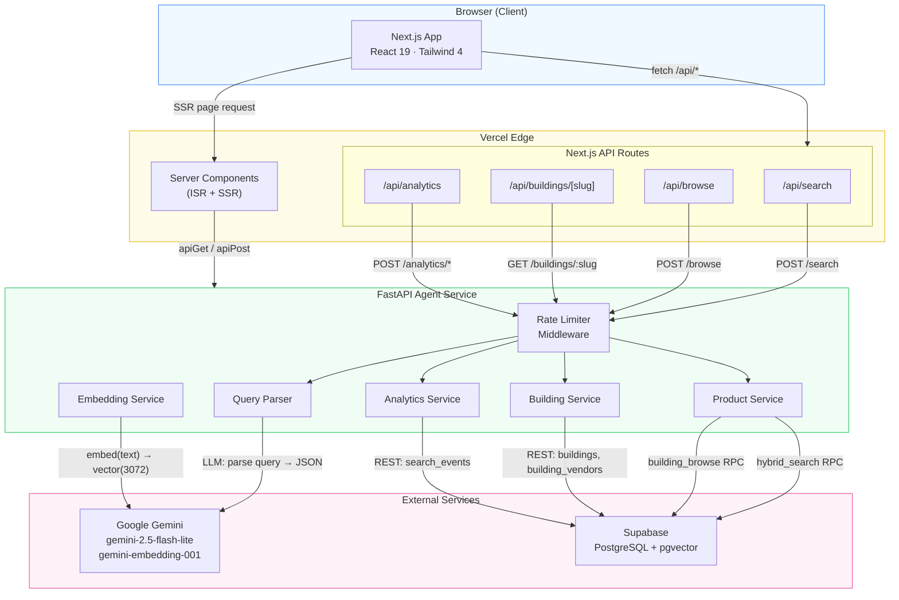
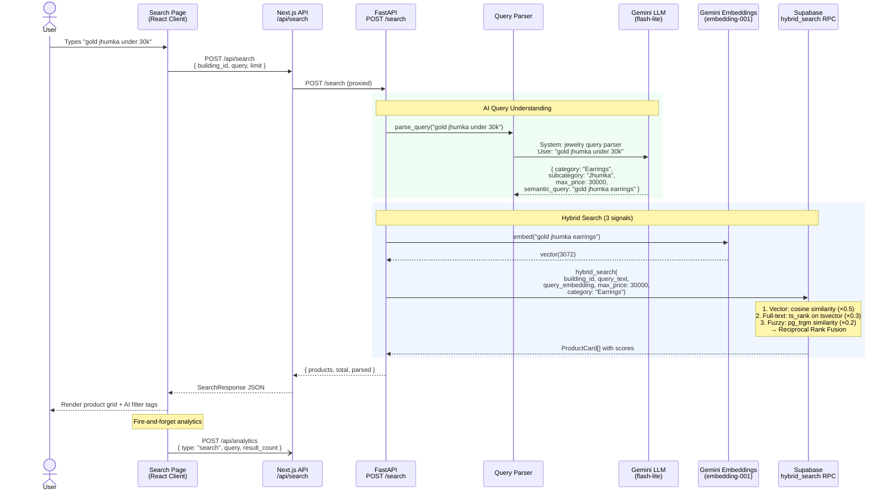
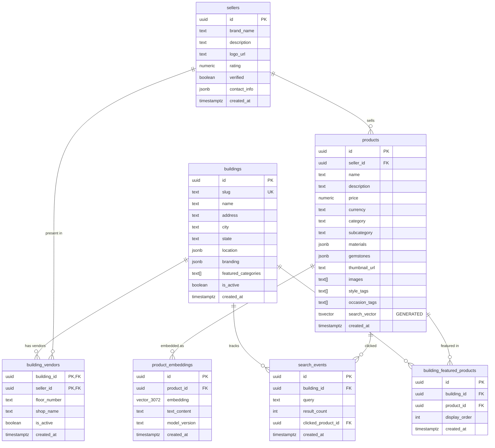
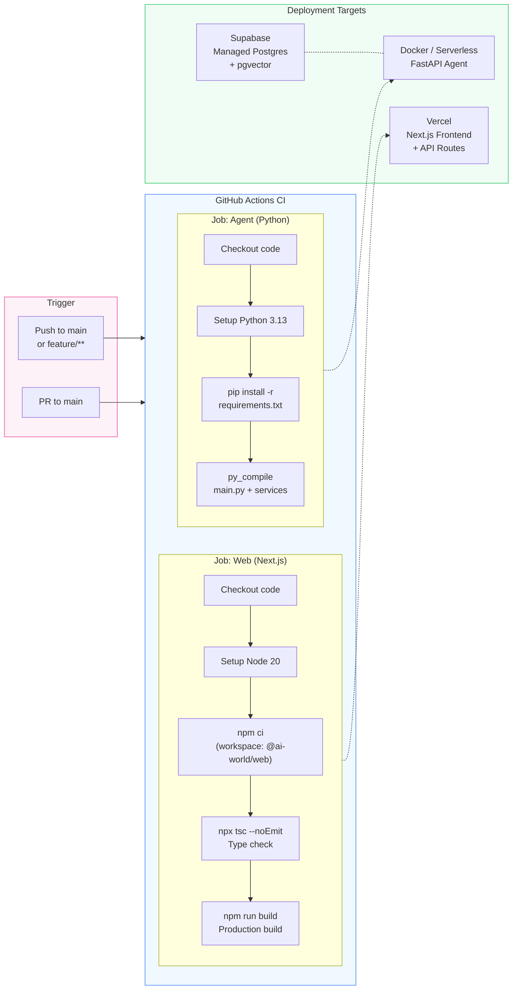

# JewelAI — Architecture Diagrams

## 1. System Overview

High-level view of all components, services, and their interactions.

---

## 2. Search Query Flow

End-to-end data flow when a user searches for jewelry.

---

## 3. Database Schema (ER Diagram)

All tables, relationships, and key columns.

---

## 4. Multi-Tenancy & Routing Model

How buildings, vendors, and products relate to URL structure.

```mermaid
graph TB
    subgraph URLStructure["URL Routing (Next.js App Router)"]
        Root["/ → redirect"]
        BHome["/zaveri-bazaar-mumbai"]
        BSearch["/zaveri-bazaar-mumbai/search?q=..."]
        BCat["/zaveri-bazaar-mumbai/category/Rings"]
        BProd["/zaveri-bazaar-mumbai/product/uuid"]
    end

    subgraph Tenancy["Multi-Tenant Data Model"]
        B1["🏢 Building: Zaveri Bazaar Mumbai<br/>slug: zaveri-bazaar-mumbai<br/>branding: { primary_color, welcome_message }"]
        B2["🏢 Building: Jewel Plaza Jaipur<br/>slug: jewel-plaza-jaipur<br/>branding: { primary_color, welcome_message }"]

        V1["🏪 Vendor A<br/>Shop: Royal Gold<br/>Floor: Ground Floor"]
        V2["🏪 Vendor B<br/>Shop: Diamond Palace<br/>Floor: 1st Floor"]
        V3["🏪 Vendor C<br/>Shop: Gem House<br/>Floor: 2nd Floor"]

        P1["💍 Product 1<br/>by Vendor A"]
        P2["💍 Product 2<br/>by Vendor A"]
        P3["💎 Product 3<br/>by Vendor B"]
        P4["📿 Product 4<br/>by Vendor C"]
    end

    subgraph Scoping["Data Scoping"]
        HSearch["hybrid_search(building_id)<br/>Only returns products from<br/>vendors in THIS building"]
        Browse["building_browse(building_id)<br/>Filtered by building"]
        Cats["building_categories(building_id)<br/>Category counts per building"]
        Trend["trending_products(building_id)<br/>Click analytics per building"]
    end

    Root --> BHome
    BHome --> BSearch
    BHome --> BCat
    BSearch --> BProd

    B1 --> V1
    B1 --> V2
    B2 --> V2
    B2 --> V3

    V1 --> P1
    V1 --> P2
    V2 --> P3
    V3 --> P4

    B1 -. "scoped queries" .-> HSearch
    B1 -. "scoped queries" .-> Browse
    B1 -. "scoped queries" .-> Cats
    B1 -. "scoped queries" .-> Trend

    style URLStructure fill:#f0f9ff,stroke:#3b82f6
    style Tenancy fill:#fefce8,stroke:#eab308
    style Scoping fill:#f0fdf4,stroke:#22c55e
```

---

## 5. CI/CD Pipeline & Deployment

Build, test, and deploy flow.

